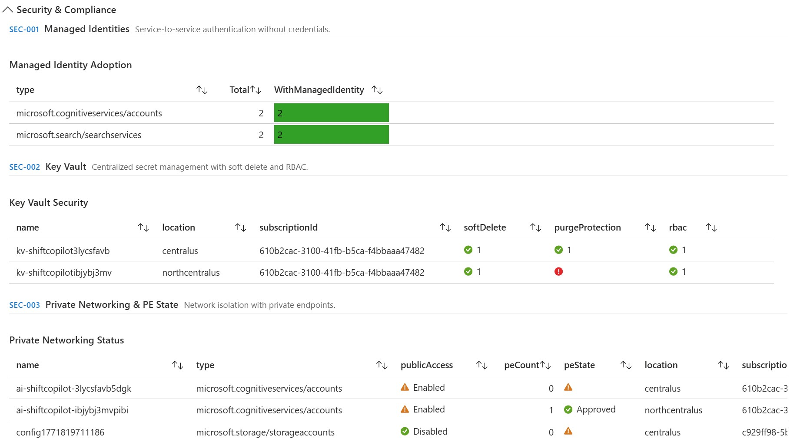

# AI Platform Readiness Assessment

[](https://github.com/krishna-sunkavalli/ai-platform-readiness-assessment/actions/workflows/validate.yml)
[](https://opensource.org/licenses/MIT)

Assess your Azure environment's readiness for AI workloads. This [Azure Monitor Workbook](https://learn.microsoft.com/azure/azure-monitor/visualize/workbooks-overview) evaluates resources across **6 capability pillars** using **Azure Resource Graph** queries and presents an interactive, shareable dashboard — no agents, no code, no external dependencies.

[](https://portal.azure.com/#create/Microsoft.Template/uri/https%3A%2F%2Fraw.githubusercontent.com%2Fkrishna-sunkavalli%2Fai-platform-readiness-assessment%2Fmain%2Fworkbook%2Fazuredeploy.json)


## What It Assesses

| Pillar | Queries | Description |
|--------|:-------:|-------------|
| **Data Management & Governance** | 8 | Purview, Data Factory, Databricks, ADLS Gen2, Microsoft Fabric |
| **Retrieval & Context Enablement** | 5 | AI Search, Redis Cache, Cosmos DB, PostgreSQL, Document Intelligence |
| **Model Management** | 8 | Azure OpenAI, ML Workspaces, GPU Compute, Microsoft Foundry, Endpoints |
| **Responsible AI** | 6 | Content Safety, Content Filtering, Content Safety Feature Matrix, Red Teaming, Guardrails |
| **Security & Compliance** | 7 | Managed Identities, Key Vault, Private Endpoints, Defender, APIM |
| **Monitoring & Operations** | 5 | App Insights, Diagnostics, Metric Alerts, Log Analytics |
| **Total** | **39** | 36 automated ARG queries + 3 Manual/API checks |

For the full list of queries with their IDs, types, and descriptions, see [queries.md](queries.md).

### Scoring Logic

Scores use a two-tier **Adoption + Configuration** model. Each signal earns base points when the resource exists, and bonus points when key best-practice configurations are detected.

| Signal | Pillar | Adopted | Configured | Configuration Check |
|--------|--------|:-------:|:----------:|---------------------|
| Purview | DMG | 3 | — | — |
| Databricks | DMG | 2 | — | — |
| Data Factory | DMG | 1 | +1 | Git integration configured |
| ADLS Gen2 | DMG | 2 | — | — |
| AI Search | RCE | 2 | — | — |
| Redis Cache | RCE | 1 | — | — |
| Cosmos DB | RCE | 1 | — | — |
| Document Intelligence | RCE | 1 | — | — |
| Azure OpenAI / AI Services | MDL | 2 | +1 | Local auth disabled (`disableLocalAuth`) |
| Microsoft Foundry | MDL | 2 | +1 | Managed identity assigned |
| Content Safety | RAI | 3 | — | — |
| Key Vault | SEC | 1 | +2 | RBAC + soft delete + purge protection |
| Managed Identity | SEC | 1 | +1 | ≥50% of AI resources have managed identity |
| Private Endpoints | SEC | — | +1 | Any AI/ML resource has a private endpoint |
| API Management | SEC | 2 | — | — |
| App Insights | MON | 3 | — | — |
| Managed Identity | MON | 2 | — | — |

**Per-pillar score** = weighted points earned / pillar max × 100%. **Overall AI Readiness Score** = total weighted points / 36 × 100%.

> **Note:** MDL-002 (ML Workspaces) and MDL-003 (GPU Compute) are shown for informational purposes and do not contribute to the score.

| Score Range | Color | Status |
|:-----------:|:-----:|--------|
| ≥ 80% | Green | Ready |
| 50–79% | Yellow | Partial |
| < 50% | Red | Needs Attention |

## Getting Started

### Prerequisites

- An Azure subscription with **Reader** role
- No additional software required — the workbook runs entirely in the Azure Portal

### Option 1: Deploy to Azure (recommended)

Click the button above, or use the direct link:

```
https://portal.azure.com/#create/Microsoft.Template/uri/https%3A%2F%2Fraw.githubusercontent.com%2Fkrishna-sunkavalli%2Fai-platform-readiness-assessment%2Fmain%2Fworkbook%2Fazuredeploy.json
```

### Option 2: Azure CLI

```bash
az group create --name rg-ai-readiness --location eastus

az deployment group create \
  --resource-group rg-ai-readiness \
  --template-file workbook/azuredeploy.json \
  --parameters workbookDisplayName="AI Platform Readiness Assessment"
```

### Option 3: Azure PowerShell

```powershell
New-AzResourceGroup -Name "rg-ai-readiness" -Location "eastus"

New-AzResourceGroupDeployment `
  -ResourceGroupName "rg-ai-readiness" `
  -TemplateFile "workbook/azuredeploy.json" `
  -workbookDisplayName "AI Platform Readiness Assessment"
```

### Option 4: Manual Import

1. Open **Azure Portal** → **Monitor** → **Workbooks**
2. Click **+ New** → **Advanced Editor** (`</>` icon)
3. Paste the contents of [`workbook/ai-readiness-assessment.workbook`](workbook/ai-readiness-assessment.workbook)
4. Click **Apply** → **Done Editing** → **Save**

## Using the Workbook

1. **Select Subscriptions** — Use the picker at the top to scope the assessment
2. **Review Summary** — The top section shows the overall score ring and per-pillar progress bars
3. **Expand Pillars** — Click each pillar section to see detailed query results
4. **Check Status Icons** — ✅ Compliant, ⚠️ Warning, ❌ Missing



## Repository Structure

```
├── workbook/
│   ├── ai-readiness-assessment.workbook   # The Azure Workbook (source of truth)
│   └── azuredeploy.json                   # ARM template for deployment
├── docs/
│   └── QUERIES.md                         # Full query reference by pillar
├── scripts/
│   ├── build-arm-template.ps1             # Regenerate ARM template from workbook
│   └── validate-queries.ps1               # Test all ARG queries against live Azure
├── .github/
│   ├── workflows/
│   │   ├── validate.yml             # CI: JSON validation & linting
│   │   └── release.yml              # Tag-triggered release packaging
│   ├── ISSUE_TEMPLATE/                    # Bug report & feature request templates
│   └── PULL_REQUEST_TEMPLATE/             # PR template with checklist
├── CHANGELOG.md
├── CODE_OF_CONDUCT.md
├── CONTRIBUTING.md
├── LICENSE
├── SECURITY.md
└── SUPPORT.md
```

## Contributing

This project welcomes contributions and suggestions. Please see [CONTRIBUTING.md](CONTRIBUTING.md) for details.

Most contributions require you to agree to a Contributor License Agreement (CLA). For details, visit https://cla.opensource.microsoft.com.

> **Maintainers:** After creating the repo, [configure branch protection](CONTRIBUTING.md#repository-setup-maintainers) on `main` to require CI checks and code review before merging.

## Trademarks

This project may contain trademarks or logos for projects, products, or services. Authorized use of Microsoft trademarks or logos is subject to and must follow [Microsoft's Trademark & Brand Guidelines](https://www.microsoft.com/en-us/legal/intellectualproperty/trademarks/usage/general). Use of Microsoft trademarks or logos in modified versions of this project must not cause confusion or imply Microsoft sponsorship. Any use of third-party trademarks or logos are subject to those third-party's policies.

## License

[MIT](LICENSE)
